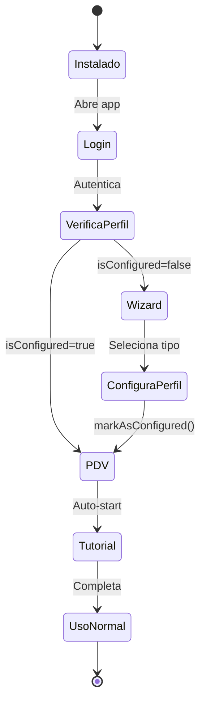

# 🚀 Fluxo de Onboarding e Primeira Execução

> **Documentação do fluxo completo desde instalação até primeira venda**  
> **Data**: 10 de Janeiro de 2026

---

## 📊 Visão Geral

O GIRO possui um sistema de onboarding multi-etapas que garante uma experiência suave desde a instalação até o primeiro uso produtivo.

```
┌─────────────┐    ┌─────────────┐    ┌─────────────┐    ┌─────────────┐
│ Instalação  │───▶│ Primeiro    │───▶│ Wizard de   │───▶│ Tutorial    │
│ Windows     │    │ Login       │    │ Perfil      │    │ Welcome     │
└─────────────┘    └─────────────┘    └─────────────┘    └─────────────┘
                                                                  │
                                                                  ▼
                                              ┌──────────────────────────┐
                                              │ Primeira Venda (PDV)     │
                                              └──────────────────────────┘
```

---

## 1️⃣ Instalação do Sistema

### Instalador Windows (NSIS)

**Arquivo**: `docs/INSTALL_WIZARD.md`

#### Etapas:

1. **Bem-vindo** - Apresentação do sistema
2. **EULA** - Termos de uso e licença
3. **Diretório** - Escolha do local de instalação (default: `C:\Program Files\GIRO`)
4. **Componentes**:
   - Aplicativo principal (obrigatório)
   - Atalho no Desktop
   - Atalho no Menu Iniciar
   - Auto-iniciar com Windows (opcional)
5. **Instalação** - Cópia de arquivos, registro, atalhos
6. **Conclusão** - Opção de iniciar o GIRO imediatamente

#### Arquivos Criados:

```
C:\Program Files\GIRO\
├── GIRO.exe                    # Executável principal
├── resources\
│   ├── app.db                  # SQLite (com seeds)
│   └── assets\
├── webview\                    # Runtime do Tauri
└── Uninstall.exe               # Desinstalador
```

#### Seeds do Banco de Dados:

Ao instalar, o sistema já vem com:

- ✅ **Funcionário Admin** (PIN: `1234`)
- ✅ **Categorias padrão** (Bebidas, Alimentos, Limpeza, etc.)
- ✅ **Settings padrão** (theme, impressora, etc.)
- ⚠️ **BusinessProfile NÃO configurado** (`isConfigured: false`)

---

## 2️⃣ Primeira Execução

### Fluxo Atual (⚠️ PROBLEMA)

```
1. Usuário abre GIRO.exe pela primeira vez
   ↓
2. App.tsx carrega
   ↓
3. Redireciona para /login (não autenticado)
   ↓
4. Usuário digita PIN 1234
   ↓
5. authenticateEmployee() retorna Employee válido
   ↓
6. login(employee) no auth-store
   ↓
7. ❌ Redireciona direto para "/" (que vai para /pdv)
   ↓
8. ❌ BusinessProfileWizard NUNCA é mostrado!
```

### Fluxo Esperado (✅ CORREÇÃO)

```
1. Usuário abre GIRO.exe pela primeira vez
   ↓
2. App.tsx carrega
   ↓
3. Redireciona para /login
   ↓
4. Usuário digita PIN 1234
   ↓
5. authenticateEmployee() OK
   ↓
6. login(employee)
   ↓
7. ✅ VERIFICAR: isConfigured do BusinessProfile
   ↓
   ├─ Se FALSE ────▶ Redirecionar para /wizard
   │                 ↓
   │                 Wizard seleciona perfil
   │                 ↓
   │                 markAsConfigured()
   │                 ↓
   │                 Redirecionar para /pdv
   │
   └─ Se TRUE ─────▶ Redirecionar para /pdv (normal)
```

---

## 3️⃣ Wizard de Perfil de Negócio

### Componente

**Arquivo**: [BusinessProfileWizard.tsx](../apps/desktop/src/components/shared/BusinessProfileWizard.tsx)

### Funcionalidades

#### Perfis Disponíveis:

| Perfil           | Ícone           | Features Exclusivas                                  |
| ---------------- | --------------- | ---------------------------------------------------- |
| **Mercearia**    | 🛒 ShoppingCart | Controle de validade, Balança, Rastreamento de lotes |
| **Motopeças**    | 🏍️ Bike         | Compatibilidade veicular, OS, Garantias, Histórico   |
| **Varejo Geral** | 🏪 Store        | Apenas features core (PDV, Estoque, Caixa)           |

#### Processo de Seleção:

1. **Escolha do Perfil**

   - Cards visuais com ícones e descrições
   - Preview de features habilitadas
   - Lista de categorias padrão

2. **Confirmação**

   - `setBusinessType(selectedType)`
   - `markAsConfigured()` → salva `isConfigured: true` no localStorage
   - Redireciona para a rota especificada

3. **Persistência**
   - Zustand + middleware `persist`
   - Salvo em: `localStorage['giro-business-profile']`
   - Rehydrata automaticamente ao recarregar

### Store: useBusinessProfile

**Arquivo**: [useBusinessProfile.ts](../apps/desktop/src/stores/useBusinessProfile.ts)

```typescript
interface BusinessProfileState {
  businessType: BusinessType;
  isConfigured: boolean; // ⭐ Flag crucial!

  profile: BusinessProfile;
  features: BusinessFeatures;
  labels: BusinessLabels;

  setBusinessType: (type) => void;
  markAsConfigured: () => void; // ⭐ Marca como já configurado
  resetProfile: () => void;
}
```

### Tipos de Perfil

**Arquivo**: [business-profile.ts](../apps/desktop/src/types/business-profile.ts)

```typescript
type BusinessType =
  | 'GROCERY' // Mercearia/Padaria
  | 'MOTOPARTS' // Oficina/Motopeças
  | 'GENERAL'; // Varejo Genérico

interface BusinessFeatures {
  // Core (sempre ativo)
  pdv: true;
  inventory: true;
  employees: true;
  cashControl: true;
  reports: true;
  backup: true;

  // Específicos por perfil
  expirationControl: boolean; // Mercearia
  weightedProducts: boolean; // Mercearia
  vehicleCompatibility: boolean; // Motopeças
  serviceOrders: boolean; // Motopeças
  warranties: boolean; // Motopeças
  // ...
}
```

---

## 4️⃣ Tutorial Welcome

### Sistema de Tutoriais

**Arquivos**:

- `TutorialProvider.tsx` - Contexto global
- `tutorial-store.ts` - Estado dos tutoriais
- `tutorials/welcome.ts` - Tour inicial

### Fluxo Welcome Tutorial

```typescript
const welcomeTutorial: Tutorial = {
  id: 'welcome',
  name: 'Bem-vindo ao GIRO',
  category: 'getting-started',
  estimatedMinutes: 5,
  steps: [
    // 1. Introdução
    { id: 'welcome-intro', placement: 'center' },

    // 2. Tour pelo Menu
    { id: 'welcome-sidebar', target: '[data-tutorial="sidebar"]' },
    { id: 'welcome-pdv', target: '[data-tutorial="nav-pdv"]' },
    { id: 'welcome-products', target: '[data-tutorial="nav-products"]' },
    { id: 'welcome-stock', target: '[data-tutorial="nav-stock"]' },
    { id: 'welcome-cash', target: '[data-tutorial="nav-cash"]' },
    { id: 'welcome-reports', target: '[data-tutorial="nav-reports"]' },

    // 3. Recursos
    { id: 'welcome-user', target: '[data-tutorial="user-menu"]' },
    { id: 'welcome-help', target: '[data-tutorial="help-button"]' },

    // 4. Conclusão
    { id: 'welcome-done', placement: 'center' },
  ],
};
```

### Auto-start do Tutorial

**TutorialProvider.tsx** (linha 110):

```typescript
useEffect(() => {
  if (!settings.enabled || !settings.showWelcomeOnFirstLogin) return;

  const welcomeProgress = getTutorialProgress('welcome');
  if (!welcomeProgress || welcomeProgress.status === 'not-started') {
    setTimeout(() => {
      if (location.pathname !== '/login') {
        startTutorial('welcome'); // ⭐ Auto-inicia!
      }
    }, 1000);
  }
}, [settings, getTutorialProgress, startTutorial, location.pathname]);
```

---

## 5️⃣ Integração Atual - ANÁLISE

### LoginPage.tsx

**Problema**: Redireciona direto após login sem verificar `isConfigured`

```typescript
// apps/desktop/src/pages/auth/LoginPage.tsx (linha 64)

const handleLogin = async () => {
  // ...
  const employee = await authenticateEmployee(pin);

  if (employee) {
    login(employee);

    // ❌ PROBLEMA: Redireciona sem verificar perfil
    navigate('/'); // vai para /pdv
  }
};
```

### App.tsx

**Análise**: Não tem lógica para interceptar e mostrar wizard

```tsx
// apps/desktop/src/App.tsx

<Routes>
  <Route path="/login" element={...} />

  <Route element={<ProtectedRoute><AppShell /></ProtectedRoute>}>
    <Route index element={<Navigate to="/pdv" replace />} />
    <Route path="dashboard" element={<DashboardPage />} />
    <Route path="pdv" element={<PDVPage />} />
    {/* ... */}

    {/* ❌ NÃO TEM ROTA /wizard */}
  </Route>
</Routes>
```

---

## 6️⃣ SOLUÇÃO: Implementação do Fluxo Completo

### Passo 1: Adicionar Rota do Wizard

**Modificar**: `App.tsx`

```tsx
import { BusinessProfileWizard } from '@/components/shared';
import { useBusinessProfile } from '@/stores/useBusinessProfile';

// ...

// Componente wrapper para proteger wizard
const WizardRoute: FC = () => {
  const { isConfigured } = useBusinessProfile();

  // Se já configurado, redirecionar
  if (isConfigured) {
    return <Navigate to="/pdv" replace />;
  }

  return <BusinessProfileWizard redirectTo="/pdv" />;
};

// Nas rotas:
<Routes>
  {/* Login */}
  <Route path="/login" element={...} />

  {/* Wizard de Perfil (antes do AppShell) */}
  <Route
    path="/wizard"
    element={
      <ProtectedRoute>
        <WizardRoute />
      </ProtectedRoute>
    }
  />

  {/* Rotas principais */}
  <Route element={<ProtectedRoute><AppShell /></ProtectedRoute>}>
    {/* ... */}
  </Route>
</Routes>
```

### Passo 2: Modificar LoginPage

**Modificar**: `LoginPage.tsx`

```tsx
import { useBusinessProfile } from '@/stores/useBusinessProfile';

export const LoginPage: FC = () => {
  const { login } = useAuthStore();
  const { isConfigured } = useBusinessProfile();
  const navigate = useNavigate();

  const handleLogin = async () => {
    // ...
    const employee = await authenticateEmployee(pin);

    if (employee) {
      login(employee);

      // ✅ CORREÇÃO: Verificar se perfil está configurado
      if (!isConfigured) {
        navigate('/wizard'); // Primeira vez → Wizard
      } else {
        navigate('/'); // Já configurado → Dashboard
      }
    }
  };
};
```

### Passo 3: Proteger Rotas Principais

**Modificar**: `App.tsx` - Adicionar guard no index

```tsx
// Componente que verifica perfil antes de entrar no sistema
const RootRedirect: FC = () => {
  const { isConfigured } = useBusinessProfile();

  if (!isConfigured) {
    return <Navigate to="/wizard" replace />;
  }

  return <Navigate to="/pdv" replace />;
};

// Na rota:
<Route
  element={
    <ProtectedRoute>
      <AppShell />
    </ProtectedRoute>
  }
>
  <Route index element={<RootRedirect />} />
  {/* ... */}
</Route>;
```

---

## 7️⃣ Fluxo Completo Final

### Primeiro Acesso

```
1. Instala GIRO.exe
   ↓
2. Abre pela primeira vez
   ↓
3. App carrega → não autenticado → /login
   ↓
4. Digita PIN 1234
   ↓
5. authenticateEmployee() OK
   ↓
6. login(employee)
   ↓
7. ✅ Verifica isConfigured === false
   ↓
8. ✅ navigate('/wizard')
   ↓
9. Wizard mostra perfis disponíveis
   ↓
10. Usuário seleciona "Mercearia"
    ↓
11. setBusinessType('GROCERY')
    ↓
12. markAsConfigured() → salva no localStorage
    ↓
13. navigate('/pdv')
    ↓
14. ✅ Tutorial Welcome auto-inicia (se habilitado)
    ↓
15. Tour de 5 minutos pelo sistema
    ↓
16. Pronto para primeira venda!
```

### Acessos Subsequentes

```
1. Abre GIRO.exe
   ↓
2. /login
   ↓
3. PIN 1234
   ↓
4. ✅ isConfigured === true
   ↓
5. navigate('/') → /pdv
   ↓
6. Uso normal do sistema
```

---

## 8️⃣ Persistência de Dados

### LocalStorage

```javascript
// giro-business-profile
{
  "state": {
    "businessType": "GROCERY",
    "isConfigured": true
  },
  "version": 0
}

// giro-auth
{
  "state": {
    "employee": { id, name, role, ... },
    "isAuthenticated": true,
    "currentSession": { ... }
  },
  "version": 0
}

// giro-tutorial
{
  "state": {
    "progress": {
      "welcome": {
        "status": "completed",
        "completedAt": "2026-01-10T10:30:00Z"
      }
    }
  }
}
```

### SQLite

```sql
-- Funcionário já existe (seed)
SELECT * FROM employees WHERE pin = '1234';

-- Settings globais
SELECT * FROM settings WHERE key LIKE 'business.%';

-- Categorias pré-criadas (dependem do perfil)
SELECT * FROM categories;
```

---

## 9️⃣ Adaptação por Perfil

### Mercearia (GROCERY)

**Features Habilitadas**:

- ✅ Controle de validade (FIFO)
- ✅ Produtos pesáveis (balança)
- ✅ Rastreamento de lotes

**Categorias Padrão**:

- Bebidas, Alimentos, Limpeza, Higiene, Mercearia

**Dashboard**:

- Produtos próximos do vencimento
- Estoque baixo
- Vendas do dia

### Motopeças (MOTOPARTS)

**Features Habilitadas**:

- ✅ Compatibilidade veicular
- ✅ Ordens de Serviço
- ✅ Garantias
- ✅ Veículos do cliente

**Categorias Padrão**:

- Peças de Motor, Freios, Suspensão, Elétrica

**Dashboard**:

- OS abertas/pendentes
- Garantias ativas
- Receita mão de obra vs peças

---

## 🔟 Testes E2E

### Cenário: Primeiro Acesso

```typescript
// tests/e2e/onboarding.spec.ts

test('should complete first-time onboarding flow', async ({ page }) => {
  // 1. Login
  await page.goto('/');
  await loginWithPin(page, '1234');

  // 2. Deve redirecionar para wizard
  await expect(page).toHaveURL('/wizard');

  // 3. Selecionar perfil
  await page.click('text=Mercearia');
  await page.click('button:has-text("Continuar")');

  // 4. Deve marcar como configurado
  const isConfigured = await page.evaluate(() => {
    const data = localStorage.getItem('giro-business-profile');
    return JSON.parse(data).state.isConfigured;
  });
  expect(isConfigured).toBe(true);

  // 5. Deve redirecionar para PDV
  await expect(page).toHaveURL('/pdv');

  // 6. Tutorial deve auto-iniciar
  await expect(page.locator('text=Bem-vindo ao GIRO')).toBeVisible();
});
```

---

## ✅ Checklist de Implementação

- [ ] **Criar WizardRoute** component
- [ ] **Adicionar rota /wizard** em App.tsx
- [ ] **Modificar LoginPage** para verificar isConfigured
- [ ] **Adicionar RootRedirect** no index route
- [ ] **Testar fluxo completo** manualmente
- [ ] **Criar testes E2E** de onboarding
- [ ] **Documentar** no README do projeto
- [ ] **Atualizar** INSTALL_WIZARD.md

---

## 📊 Diagrama de Estados



---

**Desenvolvido com ❤️ pela Arkheion Corp**
