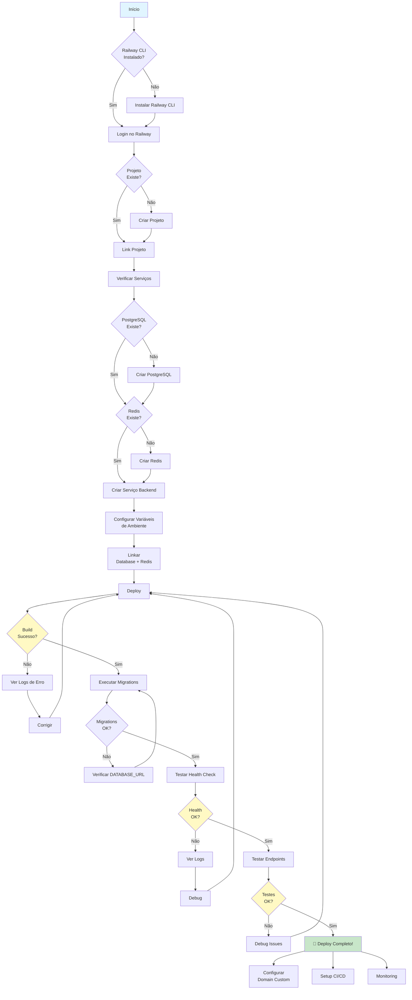
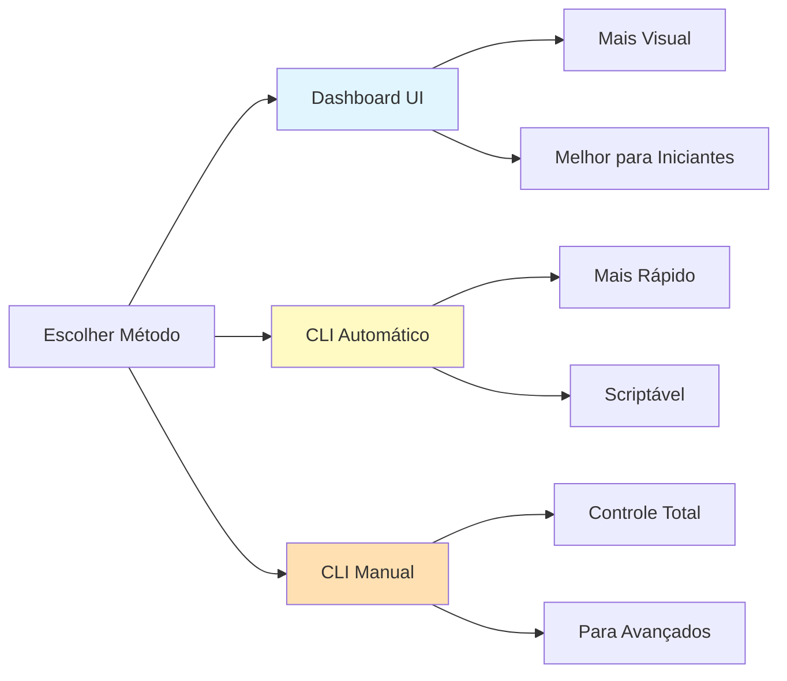
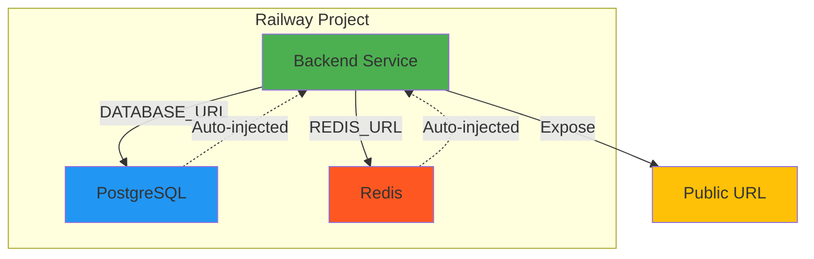
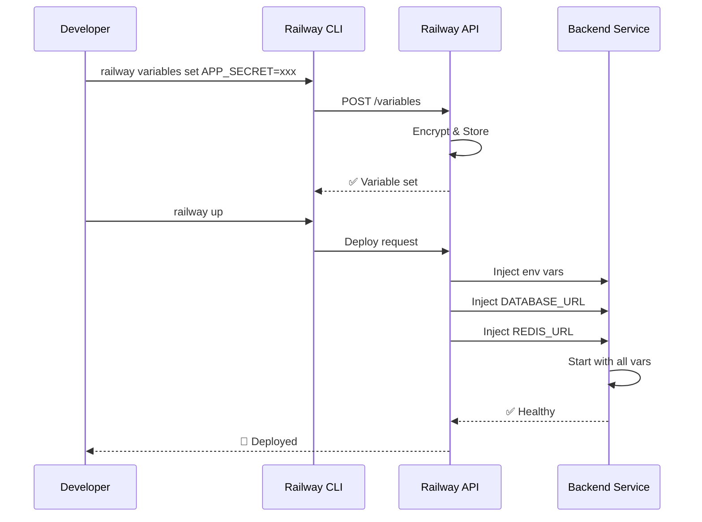
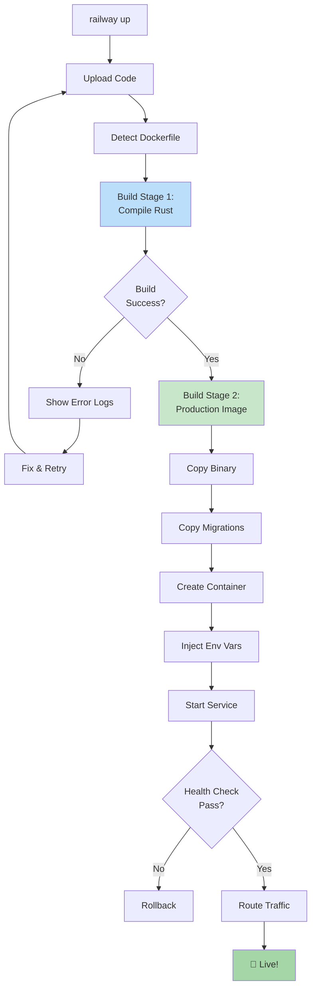
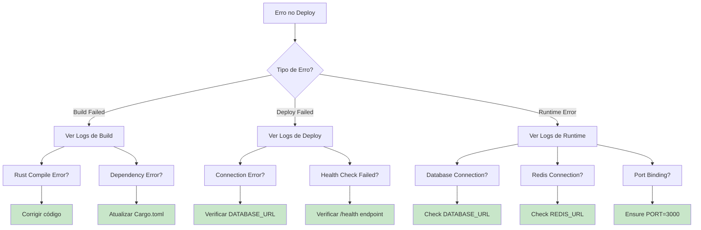

# 🚀 Deploy Railway - Fluxograma

## 📊 Visão Geral do Processo



---

## 🎯 Decisões Principais

### 1️⃣ Método de Deploy



**Recomendação:** Use **Dashboard** se é sua primeira vez, **CLI Automático** para velocidade.

---

### 2️⃣ Estrutura de Serviços



**Importante:** DATABASE_URL e REDIS_URL são **injetados automaticamente** quando você linka os serviços!

---

### 3️⃣ Fluxo de Variáveis de Ambiente



---

### 4️⃣ Build Process



---

## ⚡ Quick Reference

### Via Dashboard (5 min)

```
1. Acesse https://railway.app
2. Abra projeto: refreshing-creation
3. Add Database > PostgreSQL
4. Add Database > Redis
5. New > GitHub Repo > jhonslife/Mercearias
   - Root: giro-license-server
   - Dockerfile: backend/Dockerfile
6. Link serviços (PostgreSQL + Redis ao Backend)
7. Configure variáveis (ver DEPLOY-MANUAL.md)
8. Deploy automático inicia
9. Aguarde build (~5-10 min)
10. ✅ Done!
```

### Via CLI (1 comando)

```bash
./deploy-railway.sh
# Responda os prompts
# ✅ Done!
```

---

## 🔍 Troubleshooting Flow



### Comandos de Debug

```bash
# Ver logs em tempo real
railway logs --follow

# Ver status completo
railway status --json | jq

# Testar conexão do PostgreSQL
railway run --service postgres psql -c "SELECT 1"

# Testar conexão do Redis
railway run --service redis redis-cli ping

# Ver todas as variáveis
railway variables

# Rebuild forçado
railway up --force
```

---

## 📋 Checklist Visual

### Pré-Deploy

- [ ] Railway CLI instalado
- [ ] Autenticado (`railway whoami`)
- [ ] Dockerfile testado localmente
- [ ] Migrations funcionando local
- [ ] .env.example atualizado

### Setup Railway

- [ ] Projeto criado/linkado
- [ ] PostgreSQL provisionado
- [ ] Redis provisionado
- [ ] Backend service criado
- [ ] Serviços linkados

### Configuração

- [ ] APP_SECRET gerado
- [ ] JWT_SECRET gerado
- [ ] Todas as env vars setadas
- [ ] DATABASE_URL auto-injetado
- [ ] REDIS_URL auto-injetado

### Deploy

- [ ] Build completo (sem erros)
- [ ] Container iniciado
- [ ] Health check OK
- [ ] Migrations executadas
- [ ] Endpoints testados

### Pós-Deploy

- [ ] URL pública funcionando
- [ ] Primeiro admin criado
- [ ] Login testado
- [ ] Domain custom (opcional)
- [ ] CI/CD configurado
- [ ] Monitoring ativo

---

## 🎯 Arquitetura Final

```
┌─────────────────────────────────────────────────┐
│           Railway Cloud (us-west1)               │
├─────────────────────────────────────────────────┤
│                                                  │
│  ┌─────────────────┐     ┌──────────────────┐  │
│  │   PostgreSQL    │◄────│  Backend Service │  │
│  │   (Database)    │     │  (Rust + Axum)   │  │
│  │                 │     │                  │  │
│  │  Port: Internal │     │  Port: 3000      │  │
│  └─────────────────┘     │                  │  │
│                          │  PUBLIC_URL ──────┼──┼──► Internet
│  ┌─────────────────┐     │                  │  │
│  │      Redis      │◄────│  Dockerfile:     │  │
│  │    (Cache)      │     │  backend/...     │  │
│  │                 │     └──────────────────┘  │
│  │  Port: Internal │                           │
│  └─────────────────┘                           │
│                                                 │
│  Environment Variables (Encrypted):             │
│  • DATABASE_URL (auto)                          │
│  • REDIS_URL (auto)                             │
│  • APP_SECRET                                   │
│  • JWT_SECRET                                   │
│  • ... (todas as outras)                        │
│                                                 │
└─────────────────────────────────────────────────┘
```

---

**Pronto para deploy! Escolha seu caminho e vamos lá! 🚀**
